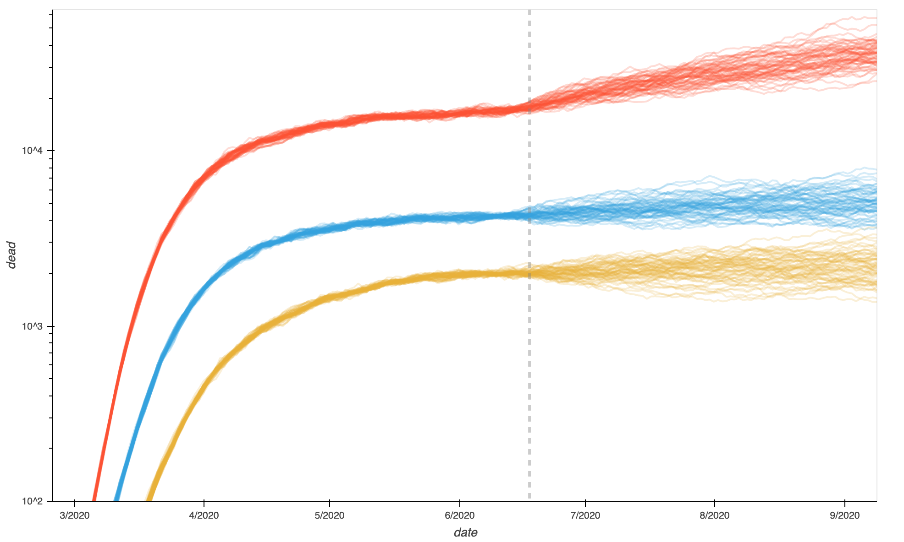
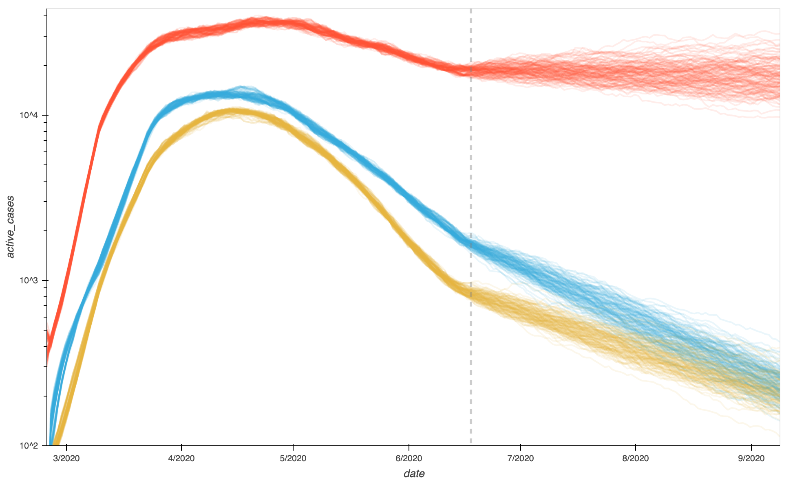

# Modeling COVID-19

This repository houses a hodgepodge of COVID-19 related analyses. I am primarily using [nevergrad](https://facebookresearch.github.io/nevergrad/) and [pymc3](https://docs.pymc.io/) to fit models within the SEIR family. Though pymc3 offers a few different ways to handle differential equations (e.g. a scipy.ode based [DifferentialEquation](https://docs.pymc.io/notebooks/ODE_API_introduction.html?highlight=differentialequation) node and a stochastic variant, [EulerMaruyama](https://docs.pymc.io/notebooks/Euler-Maruyama_and_SDEs.html?highlight=sde)) I found the ODE integration intractibly slow and needlessly precise for the slowly evolving model we consider here and found a custom implementation easier than the EulerMaruyama node given that I already had evenly spaced time steps.

My model adds noise to the observed values to represent the uncertainty surrounding them (which is equivalent to but faster than using these as observations in a noisy data model), computes the expected value of the next step for every step in the model, and compares those to the modeled next value (observed plus noise). By modifying the noise terms on the data and on the SDE transitions I can trade off the strictness of the SDE fit versus adherance to the data. Though I would prefer a more principled approach, the parameters I used are based on scrutiny of the data (to estimate realistic uncertainty terms) and the observation of some balance between deviation from the data and innovation in the model (i.e. deviation from the predicted trajectory).

Because the model is so sensitive to the model parameters (relative to my ability to guess the parameters) I was not able to get reasonable solutions with pymc3 from uninformed starting points. Instead, I used nevergrad to fit the ODE (the same model but without the noise) to the data to provide a reasonable starting point. This worked decently well but pymc3 still does not converge completely. It may be that more samples would provide the convergence I want. You can see in this [pairplot of a few parameters](https://raaperrotta.github.io/covid-binder/Italy%20COVID-19%20Model%20-%20(S)EIR%20with%20PyMC3%20and%20Nevergrad.html#3c276038-d504-4c94-9523-2cb73213a15f) that the four chains resulted in four neighboring clusters of solutions, not the single cluster you would see in an ideal situation.

The results of my work are mainly contained in a few documents, summarized here to compensate for the mess this repository has become.

### Early attempts
[This Jupyter slides presentation](https://raaperrotta.github.io/covid-binder/presentation.slides.html) from April 17th introduces the data I used for COVID-19 in the regions of Italy, an early incarnation of my pymc3 model, and some results. Here, I used the DifferentialEquation node from pymc, which was very slow and (frustratingly) became slower per iteration the more iterations it had run.

### Moving to an SDE
In [these slides](https://raaperrotta.github.io/covid-binder/presentation-2020-05-01.slides#/) from May 1st I introduce the use of the stochastic differential equation (SDE) for improved model fidelity and sampling efficiency. I also introduce a more complex model, one that separates the population into age groups, symptom levels, etc. for finer granularity of modeling. These degrees of freedom are partly constrained by observations of age distribution of cases and fatalities published by the Italian government. In this presentation, I show results of the nevergrad optimization for Lombardy, but do not attempt pymc sampling.

That pymc3 sampling proved more than a little difficult and the final results (summarized below) required significant simplifications of the model and the addition of lots more data (in this case by including many regions in Italy and assuming some parameters were constant across them).

### On the effectiveness of countermeasures

This is a bit of a break from the above work, which I return to below. In [slides](https://raaperrotta.github.io/covid-binder/presentation_2020_06_02.slides.html#/) and a [notebook](https://raaperrotta.github.io/covid-binder/On%20the%20effectiveness%20of%20lockdown%20measures.html) I analyze the data available from healthdata.org including their model estimates for true case count and their tabulation of enacted countermeasures to assess the relative effectiveness of each countermeasure type. See their [FAQ](http://www.healthdata.org/covid/faqs#social%20distancing) for category definitions.

Under the assumption that none of these measures substantially effect fatality or recovery rate, we can attribute changes in the fractional rate of growth of the estimated true cases to changes in transmission rate. You can see in [these plots](https://raaperrotta.github.io/covid-binder/On%20the%20effectiveness%20of%20lockdown%20measures.html#629bc2bc-603b-4e73-9989-3aafa1978efc) the fractional growth rate colored by the status of each of the countermeasure categories. Using a pymc3 model in which each countermeasure has an independent effect on transmission rate (except stay home orders and the closure of non-essential businesses, whose interaction was separately modeled). A baseline rate was estimated per region in the healthdata.org data and a weekly periodicity estimated to account for oscillations in their estimates.

This purposefully simple model does a reasonable job of capturing the macro trends of transmission rate and unsurprisingly fails to capture exact timeseries. See for example [this model recreation of Lombardia](https://raaperrotta.github.io/covid-binder/On%20the%20effectiveness%20of%20lockdown%20measures.html#4636b84a-45b7-49f4-838a-5942f111aaa0) or [this one for Virginia](https://raaperrotta.github.io/covid-binder/On%20the%20effectiveness%20of%20lockdown%20measures.html#48e9072d-0a39-4e55-99ab-8359bc9898cd). (Note that is seems to be mostly European data that exhibits the weekly periodicity for reasons I don't yet understand.)

[The final result](https://raaperrotta.github.io/covid-binder/On%20the%20effectiveness%20of%20lockdown%20measures.html#54491e41-5fef-4f3d-9f1e-4d2c85d71282) suggests that stay at home orders are the most effective in curbing transmission, followed by closing educational facilities, followed by closing non-essential businesses. A stay at home order combined with closing non-essential businesses is more effective than either, but only slightly. Travel limitations had the least impact, perhaps due to the wide variety of measures that fall into that category.

### Pymc sampling on a simpler model

My many efforts to make pymc3 sampling work resulted in a re-parameterized and simplified model. I removed breakdown by age and symptom level and stopped tracking the susceptible population as well as those that die or recover without being detected. This limits the model populations to those tied directly to categories in the data. This in turn allowed me to parameterize the latent true traces as the observations plus noise rather than latents observed as the data through a noise model. Because my noise model was reversible, this amounts to the same thing, but is much more efficient from an implementation perspective.

I also introduced a new model element tying detection rate to the number of tests administered. See the discussion at the top of the notebook for details.

I fit all regions of Italy (except a few with very few cases overall) using nevergrad to create a good starting point for pymc3. The results can be seen in [these plots](https://raaperrotta.github.io/covid-binder/Italy%20COVID-19%20Model%20-%20(S)EIR%20with%20PyMC3%20and%20Nevergrad.html#512274b1-e8d1-446f-903d-a14f643a35f4). Then I sampled the pymc3 equivalent of that model, saw reasonable but less than ideal convergence, and analyzed the model fit. Lastly, I used the sampled parameters to forecast the [number of deaths](https://raaperrotta.github.io/covid-binder/Italy%20COVID-19%20Model%20-%20(S)EIR%20with%20PyMC3%20and%20Nevergrad.html#86843fb1-efff-4283-a4b9-864ccc135435) and [number of cases](https://raaperrotta.github.io/covid-binder/Italy%20COVID-19%20Model%20-%20(S)EIR%20with%20PyMC3%20and%20Nevergrad.html#953350c9-fa0f-4e3f-8740-589d1474a832) over the next 12 weeks. (Plots show forecasts for Lombardia (red), Emilia-Romagna (blue), and Veneto (yellow).)

